# Architecture

cloud-8021x runs two Debian 13 RADIUS nodes with one Go application binary on each.
FreeRADIUS handles EAP-TLS and buffered accounting; Smallstep step-ca handles EC
ACME and RSA SCEP issuance. Datadog Agent/DDOT provides host checks and forwards
OpenTelemetry. The shared application ledger uses HA Cloud SQL PostgreSQL.

The [deployment guide](docs/deployment/parallel-green.md) describes the new
parallel stack. [Daemon operations](docs/daemon-operations.md) describes the
shipping commands. Previous Bash/Python and local MariaDB implementations are
retained only in Git history. Small independent CA/profile goldens preserve
compatibility comparisons without retaining the old runtime.

## Components and boundaries

| Component | Responsibility |
| --- | --- |
| `cloud-8021x serve` | Local policy, certificate authorization, inventory refresh, challenge broker, network metadata, accounting processing, telemetry and health. |
| FreeRADIUS | Certificate/TLS verification, authenticated policy requests, final replies, native accounting detail buffering and PostgreSQL intake. |
| EC/RSA step-ca | Existing certificate authorities, provisioners, ACME/SCEP issuance and renewal with authorization hooks. |
| PostgreSQL | Shared intake, session high-water state, measured intervals, durable jobs, cursors, maintenance gates and export outbox. |
| Datadog Agent/DDOT | Infrastructure monitoring and forwarding logs, metrics and traces through a persistent OTLP queue. |
| Protected Go commands | Root-only installation, credential restoration, CA adoption, server renewal, source updates and retained-work recovery. |

The daemon runs under a dedicated unprivileged account. Native RADIUS, the CAs
and telemetry collector have separate accounts and credentials. SQL administrator
credentials stay on the private provisioner and never reach a RADIUS VM.

The domain layer uses opaque device and group IDs. Device inventory is pluggable,
starting with Fleet. Network inventory and VLAN signaling are pluggable, starting
with UniFi and Meraki. Fleet group IDs such as `fleet:6` are adapter identifiers;
they do not become TLS identities or a requirement for another inventory provider.
FreeRADIUS and step-ca remain backend adapters rather than policy owners.

## Authentication and VLAN selection

1. The NAS sends an EAP-TLS request to FreeRADIUS.
2. FreeRADIUS verifies the certificate chain and possession of the private key.
   The policy adapter receives independently verified leaf identity evidence.
3. Go resolves that identity against a complete, fresh inventory snapshot. SCEP
   authorization binds the exact certificate fingerprint to an enrolled device.
   Configured attested ACME uses its separate verified hardware-serial path.
4. Policy maps the device's current groups and trusted RADIUS source location to
   the configured VLAN. Conflicting group mappings and unknown or stale identity
   fail closed. A site's explicit dynamic VLAN opt-out returns no VLAN assignment.
5. The vendor signaler produces the RADIUS reply attributes. UniFi uses
   `Tunnel-Type=13`, `Tunnel-Medium-Type=6` and the configured numeric VLAN ID.

CSR subjects, outer EAP usernames, client MAC addresses and NAS-provided location
names do not authorize a device. Network API metadata labels logs; it does not
replace trusted source matching. VLAN IDs can differ between sites for the same
group. VLAN and membership changes take effect on authentication; cloud-8021x
does not disconnect an existing session or send CoA.

The initial rollout remains Wi-Fi only. Shared policy and accounting concepts do
not require Wi-Fi, but wired client support needs its own configured scope and
acceptance checks. See [dynamic VLANs](docs/dynamic-vlans.md).

## Certificate inventory and enrollment

Fleet's observer inventory and separately scoped certificate collector intersect
complete device inventories. Apple collection uses managed identity certificates
from authenticated MDM commands. Windows collection uses authenticated Fleet
SYSTEM scripts and machine-store public certificates. ACME profile exemptions
avoid unnecessary certificate polling.

Certificate authorization retains the original observation time and individual
expiry. Reading an old result cannot refresh it. Current enrollment and configured
profile eligibility are checked separately. A removed, changed, unsupported,
ambiguous or stale binding is not rescued by a certificate Common Name.

Durable PostgreSQL reservations enforce collection cadence and pending-command
budgets across both nodes. Uncertain remote submissions remain quarantined;
timeouts and missing result history do not authorize resends. Signed adoption
carries original certificate observations and unresolved-command ownership into
the new stack without importing accounting history.

The challenge broker accepts Fleet's authenticated requests and issues bounded
SCEP challenges. A challenge permits issuance; it does not prove device identity
or authorize RADIUS. The loopback CA authorization hook uses mutual TLS. Both
nodes share the preserved challenge and broker identities. See
[SCEP identity binding](docs/scep-identity-binding.md).

## Buffered accounting and usage

```mermaid
flowchart LR
  NAS[NAS accounting] --> Detail[Native detail spool]
  Detail --> Replay[FreeRADIUS buffered replay]
  Replay --> Intake[PostgreSQL intake]
  Intake --> Workers[Go accounting workers]
  Workers --> Ledger[Session state and measured intervals]
  Ledger --> Outbox[Durable export outbox]
  Outbox --> OTLP[OTLP]
  OTLP --> DDOT[Datadog Agent/DDOT]
  DDOT --> Datadog[Datadog]
```

Go owns the versioned intake and ledger schema; FreeRADIUS uses a fixed
append-only SQL adapter. Native replay advances only after its intake write
succeeds. Go uses transaction locks,
stable event identities and session high-water state to process reports from
both servers without double-counting retries. Signed Class context binds the
accounting record to its original authentication context.

Usage comes from counter increases between valid reports. A new accounting epoch
starts without old history: the first ongoing-session report is a baseline.
Upload and download are expressed from the device's perspective. Report cadence
bounds the precision of selected time windows; usage is not an instantaneous
traffic meter. Exact measured intervals remain in PostgreSQL.

Local spooling is not replicated storage. A server or disk loss before shared
intake can lose locally buffered records. PostgreSQL protects committed shared
state; it does not retroactively replicate the spool. OTLP delivery can also be
ambiguous, so downstream telemetry is at least once. Stable event IDs and explicit
quarantine/recovery preserve that distinction. No usage worker reads Datadog logs
to reconstruct accounting.

## Final authentication logs and observability

FreeRADIUS writes private final-auth detail files with distinct activation
generations. Go reads bounded records and commits cursor progress together with
outbox work. Metadata enrichment supplies device/owner/site/AP/VLAN labels where
available; missing display information does not grant network access.

During an already required protected renewal stop, auth cleanup may remove only
closed generations whose committed cursors prove consumption to EOF. It preserves
current, rollback, unconsumed and uncertain generations. A reboot or manual restart
cannot fabricate evidence that a previous log generation is safely closed.

Application logging uses structured logrus fields and the OpenTelemetry bridge.
Metrics and traces use OTel APIs; the exporter uses OTLP. Business records remain
independent of trace sampling. Datadog-specific deployment configuration belongs
to the collector/observability adapter. See [observability configuration](terraform/observability/README.md).

## Installation, high availability and rollback

The thin startup loader verifies immutable artifact hashes and instance identity,
then invokes `cloud-8021x bootstrap prepare --incoming`. Go validates the platform,
package closure, config, SQL CA and exact existing CA material before protected
publication. It preserves root-private installation receipts and rollback files.
There is no server-side generated Python, runtime package resolver or separate
environment-driven webhook executable.

Green preparation is passive. Signed source handoff and peer readiness are
required before the coordinated activation enables shared workers and traffic.
An active node restart requires authenticated peer readiness and a shared
maintenance gate. The old production pair, CA state and stable enrollment routes
remain available until the separately approved cutover succeeds.

Full systemd boot/reboot, real cloud IAM/KMS, physical AP VLAN/DHCP, client profile
renewal and two-node cutover/failover remain staging gates. Container and unit
suites do not prove those results. See [tests](tests/README.md),
[protected bootstrap](docs/bootstrap/README.md) and
[validation scope](docs/validation/scope-review.md).
